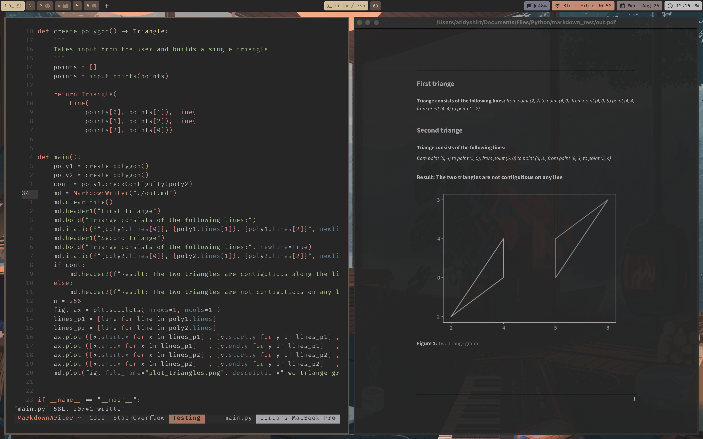

# MarkdownWriter

A little module to write markdown output from python code

### Installing

> Note: this module is not yet at version one.

To install the current release using pip, run the following:

```sh
pip install --index-url https://test.pypi.org/simple/ --no-deps markdown-writer-atidyshirt
```

### Example of use in a basic project

```python
def main():
    poly1 = create_polygon()
    poly2 = create_polygon()
    cont = poly1.checkContiguity(poly2)
    md = MarkdownWriter("./out.md")
    md.clear_file()
    md.header1("First triange")
    md.bold("Triange consists of the following lines:")
    md.italic(f"{poly1.lines[0]}, {poly1.lines[1]}, {poly1.lines[2]}", newline=True)
    md.header1("Second triange")
    md.bold("Triange consists of the following lines:", newline=True)
    md.italic(f"{poly2.lines[0]}, {poly2.lines[1]}, {poly2.lines[2]}", newline=True)
    if cont:
        md.header2(f"Result: The two triangles are contigutious along the line {cont}")
    else:
        md.header2(f"Result: The two triangles are not contigutious on any line")
    n = 256
    fig, ax = plt.subplots( nrows=1, ncols=1 )
    lines_p1 = [line for line in poly1.lines]
    lines_p2 = [line for line in poly2.lines]
    ax.plot ([x.start.x for x in lines_p1] , [y.start.y for y in lines_p1] , color='blue' , alpha=1.00)
    ax.plot ([x.end.x for x in lines_p1]   , [y.end.y for y in lines_p1]   , color='blue' , alpha=1.00)
    ax.plot ([x.start.x for x in lines_p2] , [y.start.y for y in lines_p2] , color='red'  , alpha=1.00)
    ax.plot ([x.end.x for x in lines_p2]   , [y.end.y for y in lines_p2]   , color='red'  , alpha=1.00)
    md.plot(fig, file_name="plot_triangles.png", description="Two triange graph")
```

> Generated output

```md
# First triangle

**Triangle consists of the following lines:**

*from point (1, 2) to point (2, 6), from point (2, 6) to point (3, 1), from point (3, 1) to point (1, 2)*

# Second triangle

**Triangle consists of the following lines:**

*from point (3, 1) to point (2, 6), from point (2, 6) to point (5, 5), from point (5, 5) to point (3, 1)*

## Result: The two triangles are contigutious along the line from point (2, 6) to point (3, 1)


```

### Showcase of generated output


